# Design Document

## Overview

The Aircraft Defect Detection System is a full-stack web application that combines deep learning models (YOLOv8 and GPT Vision API) to automate aircraft visual inspections. The system features a responsive frontend with separate user and admin interfaces, a RESTful backend API, MongoDB database for data persistence, and an ML inference pipeline that achieves 95% mAP through ensemble model predictions.

### Technology Stack

**Frontend:**
- HTML5, CSS3, JavaScript (ES6+)
- Bootstrap 5 for responsive UI components
- Chart.js for data visualizations
- Axios for HTTP requests

**Backend:**
- Node.js with Express.js framework
- JWT for authentication and session management
- Multer for file upload handling
- bcrypt for password hashing

**Database:**
- MongoDB 6.0+ for data persistence
- Mongoose ODM for schema modeling and validation

**ML/AI:**
- Python 3.10+ for ML inference services
- YOLOv8 (Ultralytics) for object detection
- OpenAI GPT-4 Vision API for secondary analysis
- OpenCV for image preprocessing
- NumPy for numerical operations

**Infrastructure:**
- Docker for containerization
- AWS S3 (or local storage) for image repository
- Redis for caching model weights and session data

## Architecture

### System Architecture Diagram

```mermaid
graph TB
    subgraph "Client Layer"
        UI[User Interface - HTML/CSS/JS]
        AdminUI[Admin Interface - HTML/CSS/JS]
    end
    
    subgraph "Application Layer"
        API[Express.js REST API]
        Auth[Authentication Middleware]
        Upload[File Upload Service]
    end
    
    subgraph "ML Inference Layer"
        Gateway[ML Gateway Service]
        YOLO[YOLOv8 Detection Service]
        GPT[GPT Vision API Client]
        Ensemble[Ensemble Aggregator]
        Preprocess[Image Preprocessing]
    end
    
    subgraph "Data Layer"
        MongoDB[(MongoDB Database)]
        S3[Image Repository - S3]
        Redis[(Redis Cache)]
    end
    
    UI --> API
    AdminUI --> API
    API --> Auth
    API --> Upload
    API --> Gateway
    Upload --> S3
    Gateway --> Preprocess
    Preprocess --> YOLO
    Preprocess --> GPT
    YOLO --> Ensemble
    GPT --> Ensemble
    Ensemble --> API
    API --> MongoDB
    API --> Redis
    
    style UI fill:#e1f5ff
    style AdminUI fill:#e1f5ff
    style API fill:#fff4e1
    style Gateway fill:#f0e1ff
    style MongoDB fill:#e1ffe1
    style S3 fill:#e1ffe1
```



### Request Flow

1. **Authentication Flow:**
   - User submits credentials → API validates against MongoDB → JWT token generated → Token stored in Redis → Client receives token

2. **Image Upload & Detection Flow:**
   - User uploads image → API validates file → Image stored in S3 → ML Gateway triggered → Preprocessing applied → Parallel inference (YOLOv8 + GPT Vision) → Ensemble aggregation → Results stored in MongoDB → Response sent to client

3. **Admin Model Management Flow:**
   - Admin uploads training data → API validates labels → Training job queued → YOLOv8 retraining → Model validation (mAP check) → Model versioning → Deployment to inference service

## Components and Interfaces

### Frontend Components

#### 1. User Interface Pages

**login.html**
- Login form with username/password fields
- Registration link
- Form validation
- Error message display

**register.html**
- Registration form (username, email, password, confirm password)
- Password strength indicator
- Form validation with real-time feedback

**user-dashboard.html**
- Navigation sidebar (Upload, Results, History, Profile)
- Statistics cards (total inspections, defects found)
- Recent inspections list
- Quick upload button

**upload.html**
- Drag-and-drop file upload zone
- Multi-file selection support
- Upload progress bars
- File preview thumbnails

**results.html**
- Image display with bounding box overlays
- Defect list panel with filters
- Confidence score indicators
- Export report buttons (PDF/JSON)
- Color-coded defect classes

**history.html**
- Inspection records table with pagination
- Search and filter controls (date range, defect type)
- Trend visualization charts
- Comparison view for multiple inspections

#### 2. Admin Interface Pages

**admin-dashboard.html**
- Navigation sidebar (Users, Models, Monitoring, Settings)
- System metrics overview
- Active users count
- Model performance statistics

**admin-users.html**
- User management table (username, email, role, status)
- Create/edit user modal
- Deactivate/activate user actions
- Role assignment controls

**admin-models.html**
- Model version history table
- Upload training dataset interface
- Retrain model button with progress tracking
- Model performance comparison charts (mAP, inference time)

**admin-monitoring.html**
- Real-time system metrics dashboard
- API usage statistics (GPT Vision calls, costs)
- Error logs table with severity filters
- Performance graphs (processing time, throughput)

### Backend API Endpoints

#### Authentication Endpoints

```
POST /api/auth/register
Body: { username, email, password, confirmPassword }
Response: { message, userId }

POST /api/auth/login
Body: { username, password }
Response: { token, user: { id, username, email, role } }

POST /api/auth/logout
Headers: { Authorization: Bearer <token> }
Response: { message }

GET /api/auth/verify
Headers: { Authorization: Bearer <token> }
Response: { valid: boolean, user: { id, username, role } }
```

#### User Management Endpoints (Admin Only)

```
GET /api/admin/users
Headers: { Authorization: Bearer <token> }
Query: { page, limit, search, role }
Response: { users: [], total, page, pages }

POST /api/admin/users
Headers: { Authorization: Bearer <token> }
Body: { username, email, password, role }
Response: { message, userId }

PUT /api/admin/users/:id
Headers: { Authorization: Bearer <token> }
Body: { email, role, status }
Response: { message, user }

DELETE /api/admin/users/:id
Headers: { Authorization: Bearer <token> }
Response: { message }
```

#### Image Upload & Detection Endpoints

```
POST /api/inspections/upload
Headers: { Authorization: Bearer <token> }
Body: FormData with image files
Response: { inspectionIds: [], message }

POST /api/inspections/:id/analyze
Headers: { Authorization: Bearer <token> }
Response: { inspectionId, status: "processing" }

GET /api/inspections/:id/results
Headers: { Authorization: Bearer <token> }
Response: { 
  inspectionId, 
  imageUrl, 
  status,
  defects: [{ 
    class, 
    confidence, 
    bbox: { x, y, width, height },
    source: "yolo|gpt|ensemble"
  }],
  processingTime,
  timestamp
}

GET /api/inspections
Headers: { Authorization: Bearer <token> }
Query: { page, limit, startDate, endDate, defectClass }
Response: { inspections: [], total, page, pages }

GET /api/inspections/:id/report
Headers: { Authorization: Bearer <token> }
Query: { format: "pdf|json" }
Response: File download or JSON data
```

#### Model Management Endpoints (Admin Only)

```
GET /api/admin/models
Headers: { Authorization: Bearer <token> }
Response: { models: [{ version, mAP, createdAt, status }] }

POST /api/admin/models/train
Headers: { Authorization: Bearer <token> }
Body: FormData with training images and labels
Response: { jobId, message }

GET /api/admin/models/train/:jobId
Headers: { Authorization: Bearer <token> }
Response: { jobId, status, progress, metrics: { loss, mAP } }

POST /api/admin/models/:version/deploy
Headers: { Authorization: Bearer <token> }
Response: { message, deployedVersion }
```

#### Monitoring Endpoints (Admin Only)

```
GET /api/admin/monitoring/metrics
Headers: { Authorization: Bearer <token> }
Query: { startDate, endDate }
Response: {
  totalInspections,
  avgProcessingTime,
  apiCalls: { gpt: count, cost },
  errorCount,
  activeUsers
}

GET /api/admin/monitoring/logs
Headers: { Authorization: Bearer <token> }
Query: { page, limit, severity, startDate, endDate }
Response: { logs: [], total, page, pages }
```

### ML Inference Services

#### ML Gateway Service (Python Flask)

```python
# Endpoint: POST /ml/detect
# Input: { imageUrl, inspectionId }
# Process:
#   1. Download image from S3
#   2. Preprocess image (resize, normalize, enhance)
#   3. Parallel inference: YOLOv8 + GPT Vision
#   4. Ensemble aggregation
#   5. Return results
# Output: { defects: [], processingTime }
```

#### YOLOv8 Detection Service

```python
# Class: YOLODetector
# Methods:
#   - load_model(version): Load YOLOv8 weights
#   - detect(image): Run inference
#   - postprocess(results): Convert to standard format
# Output: [{ class, confidence, bbox }]
```

#### GPT Vision Client

```python
# Class: GPTVisionClient
# Methods:
#   - analyze_image(image, detected_regions): Call GPT-4 Vision API
#   - parse_response(response): Extract defect information
# Output: [{ class, confidence, bbox, description }]
```

#### Ensemble Aggregator

```python
# Class: EnsembleAggregator
# Methods:
#   - aggregate(yolo_results, gpt_results): Combine predictions
#   - apply_nms(detections): Non-maximum suppression
#   - weighted_voting(detections): Resolve conflicts
# Logic:
#   - If both models agree (IoU > 0.5): Average confidence
#   - If only one detects: Use if confidence > 0.7
#   - If conflict: Use weighted voting (YOLO: 0.6, GPT: 0.4)
# Output: [{ class, confidence, bbox, source }]
```

## Data Models

### MongoDB Collections

#### users Collection

```javascript
{
  _id: ObjectId,
  username: String (unique, required, indexed),
  email: String (unique, required, indexed),
  password: String (hashed with bcrypt, required),
  role: String (enum: ["user", "admin"], default: "user"),
  status: String (enum: ["active", "inactive"], default: "active"),
  createdAt: Date (default: Date.now),
  updatedAt: Date,
  lastLogin: Date,
  failedLoginAttempts: Number (default: 0),
  lockoutUntil: Date
}
```

#### inspections Collection

```javascript
{
  _id: ObjectId,
  userId: ObjectId (ref: "users", required, indexed),
  imageUrl: String (S3 URL, required),
  imageMetadata: {
    filename: String,
    size: Number,
    format: String,
    dimensions: { width: Number, height: Number },
    uploadedAt: Date
  },
  status: String (enum: ["uploaded", "processing", "completed", "failed"], indexed),
  defects: [{
    class: String (enum: defect classes, required),
    confidence: Number (0-1, required),
    bbox: {
      x: Number,
      y: Number,
      width: Number,
      height: Number
    },
    source: String (enum: ["yolo", "gpt", "ensemble"])
  }],
  processingTime: Number (milliseconds),
  modelVersion: String,
  createdAt: Date (default: Date.now, indexed),
  updatedAt: Date,
  aircraftId: String (optional, indexed),
  notes: String
}
```

#### models Collection

```javascript
{
  _id: ObjectId,
  version: String (unique, required, indexed),
  type: String (enum: ["yolov8", "ensemble"]),
  status: String (enum: ["training", "validating", "deployed", "archived"]),
  metrics: {
    mAP: Number,
    precision: Number,
    recall: Number,
    f1Score: Number,
    classMetrics: [{
      class: String,
      ap: Number,
      precision: Number,
      recall: Number
    }]
  },
  trainingConfig: {
    epochs: Number,
    batchSize: Number,
    learningRate: Number,
    imageSize: Number,
    augmentation: Object
  },
  datasetInfo: {
    totalImages: Number,
    trainSplit: Number,
    valSplit: Number,
    classes: [String]
  },
  weightsUrl: String (S3 URL),
  createdBy: ObjectId (ref: "users"),
  createdAt: Date (default: Date.now),
  deployedAt: Date
}
```

#### apiLogs Collection

```javascript
{
  _id: ObjectId,
  service: String (enum: ["gpt-vision", "yolo", "ensemble"]),
  endpoint: String,
  userId: ObjectId (ref: "users", indexed),
  inspectionId: ObjectId (ref: "inspections", indexed),
  requestData: Object,
  responseTime: Number (milliseconds),
  status: String (enum: ["success", "error"]),
  errorMessage: String,
  tokenUsage: Number (for GPT Vision),
  cost: Number (for GPT Vision),
  timestamp: Date (default: Date.now, indexed)
}
```

#### systemLogs Collection

```javascript
{
  _id: ObjectId,
  level: String (enum: ["info", "warning", "error", "critical"], indexed),
  component: String (indexed),
  message: String,
  details: Object,
  userId: ObjectId (ref: "users"),
  timestamp: Date (default: Date.now, indexed),
  resolved: Boolean (default: false)
}
```

### Mongoose Schemas

```javascript
// User Schema with validation
const userSchema = new mongoose.Schema({
  username: {
    type: String,
    required: true,
    unique: true,
    trim: true,
    minlength: 3,
    maxlength: 30
  },
  email: {
    type: String,
    required: true,
    unique: true,
    lowercase: true,
    validate: {
      validator: function(v) {
        return /^[\w-\.]+@([\w-]+\.)+[\w-]{2,4}$/.test(v);
      },
      message: 'Invalid email format'
    }
  },
  password: {
    type: String,
    required: true,
    minlength: 8
  },
  role: {
    type: String,
    enum: ['user', 'admin'],
    default: 'user'
  },
  status: {
    type: String,
    enum: ['active', 'inactive'],
    default: 'active'
  },
  failedLoginAttempts: {
    type: Number,
    default: 0
  },
  lockoutUntil: Date,
  lastLogin: Date
}, {
  timestamps: true
});

// Indexes
userSchema.index({ username: 1 });
userSchema.index({ email: 1 });
userSchema.index({ status: 1 });
```

## Error Handling

### Error Response Format

```javascript
{
  success: false,
  error: {
    code: String,  // e.g., "AUTH_FAILED", "INVALID_FILE", "ML_ERROR"
    message: String,  // User-friendly message
    details: Object,  // Additional error context (dev mode only)
    timestamp: Date
  }
}
```

### Error Categories

1. **Authentication Errors (401)**
   - Invalid credentials
   - Expired token
   - Account locked

2. **Authorization Errors (403)**
   - Insufficient permissions
   - Admin-only resource access

3. **Validation Errors (400)**
   - Invalid file format
   - Missing required fields
   - File size exceeded

4. **ML Processing Errors (500)**
   - Model inference failure
   - GPT Vision API timeout
   - Image preprocessing error

5. **Database Errors (500)**
   - Connection failure
   - Query timeout
   - Data integrity violation

### Error Handling Strategy

- **Frontend**: Display user-friendly error messages with retry options
- **Backend**: Log detailed errors to systemLogs collection
- **ML Services**: Implement retry logic with exponential backoff for API calls
- **Database**: Use transactions for critical operations (user creation, inspection updates)

## Testing Strategy

### Unit Testing

**Backend (Jest + Supertest)**
- Authentication middleware tests
- API endpoint tests with mocked database
- Validation logic tests
- JWT token generation/verification tests

**Frontend (Jest + Testing Library)**
- Form validation tests
- Component rendering tests
- User interaction tests
- API call mocking tests

**ML Services (pytest)**
- YOLOv8 inference tests with sample images
- Ensemble aggregation logic tests
- Image preprocessing tests
- GPT Vision API client tests with mocked responses

### Integration Testing

- End-to-end user registration and login flow
- Complete inspection workflow (upload → detection → results → report)
- Admin model management workflow
- Database operations with test MongoDB instance

### Performance Testing

- Load testing with Apache JMeter (100 concurrent users)
- ML inference latency testing (target: <10s per image)
- Database query performance testing
- API rate limiting tests

### Security Testing

- SQL injection prevention (N/A for MongoDB, but test NoSQL injection)
- XSS prevention in user inputs
- CSRF token validation
- JWT token expiration and refresh
- Password hashing verification
- File upload security (malicious file detection)

## Security Considerations

### Authentication & Authorization

- JWT tokens with 24-hour expiration
- Refresh token mechanism for extended sessions
- Role-based access control (RBAC) middleware
- Account lockout after 5 failed login attempts
- Password complexity enforcement (regex validation)
- bcrypt hashing with salt rounds = 10

### Data Protection

- HTTPS/TLS for all API communications
- Environment variables for sensitive credentials
- MongoDB connection string encryption
- S3 bucket access control with IAM roles
- Redis password protection

### Input Validation

- File type validation (whitelist: JPEG, PNG, TIFF)
- File size limits (50MB per image)
- Image dimension validation (640x640 to 4096x4096)
- SQL/NoSQL injection prevention
- XSS sanitization for user inputs

### API Security

- Rate limiting (100 requests per minute per user)
- CORS configuration (whitelist allowed origins)
- API key rotation for GPT Vision API
- Request size limits
- Timeout configurations

## Deployment Architecture

### Docker Containers

1. **Frontend Container**: Nginx serving static HTML/CSS/JS files
2. **Backend Container**: Node.js Express API
3. **ML Service Container**: Python Flask with YOLOv8
4. **MongoDB Container**: MongoDB 6.0
5. **Redis Container**: Redis 7.0

### Environment Variables

```
# Backend
NODE_ENV=production
PORT=3000
MONGODB_URI=mongodb://mongo:27017/aircraft_detection
REDIS_URL=redis://redis:6379
JWT_SECRET=<secret>
JWT_EXPIRATION=24h
AWS_S3_BUCKET=aircraft-images
AWS_ACCESS_KEY_ID=<key>
AWS_SECRET_ACCESS_KEY=<secret>
OPENAI_API_KEY=<key>

# ML Service
ML_SERVICE_PORT=5000
YOLO_MODEL_PATH=/models/yolov8_latest.pt
YOLO_CONFIDENCE_THRESHOLD=0.5
GPT_VISION_MODEL=gpt-4-vision-preview
ENSEMBLE_YOLO_WEIGHT=0.6
ENSEMBLE_GPT_WEIGHT=0.4
```

### Scaling Considerations

- Horizontal scaling of backend API (load balancer)
- ML service scaling with GPU instances
- MongoDB replica set for high availability
- Redis cluster for distributed caching
- S3 for scalable image storage
- CDN for static asset delivery

## Performance Optimization

### Caching Strategy

- Redis caching for:
  - User session data (24-hour TTL)
  - Model weights (persistent)
  - Frequently accessed inspection results (1-hour TTL)
  - API response caching for identical requests (5-minute TTL)

### Database Optimization

- Indexes on frequently queried fields (userId, createdAt, status)
- Aggregation pipelines for trend analysis
- Connection pooling (max 100 connections)
- Query result pagination (default 20 items per page)

### ML Inference Optimization

- Model weight preloading on service startup
- Batch processing for multiple images
- GPU acceleration for YOLOv8 inference
- Image preprocessing pipeline optimization
- Parallel execution of YOLO and GPT Vision calls

### Frontend Optimization

- Lazy loading for images
- Code splitting for JavaScript bundles
- Minification and compression (gzip)
- Browser caching for static assets
- Progressive image loading for results page

## Monitoring and Logging

### Application Monitoring

- Request/response logging with Morgan
- Error tracking with Winston logger
- Performance metrics collection (response times, throughput)
- Health check endpoints (/health, /ready)

### ML Service Monitoring

- Inference time tracking per model
- Model accuracy monitoring (mAP trends)
- GPT Vision API usage and cost tracking
- Error rate monitoring

### Database Monitoring

- Query performance monitoring
- Connection pool utilization
- Storage usage tracking
- Slow query logging

### Alerting

- Email alerts for critical errors
- Slack notifications for system warnings
- Dashboard alerts for API usage thresholds
- Model performance degradation alerts

