# Aircraft Defect Detection System - Sequence Diagrams, ER Diagrams & Flowcharts

This document contains formal diagrams using Mermaid syntax for visualization in markdown-compatible viewers.

## Table of Contents
1. [Sequence Diagrams](#sequence-diagrams)
2. [Entity Relationship Diagrams](#entity-relationship-diagrams)
3. [Flowcharts](#flowcharts)

---

## Sequence Diagrams

### 1. User Registration and Login Sequence

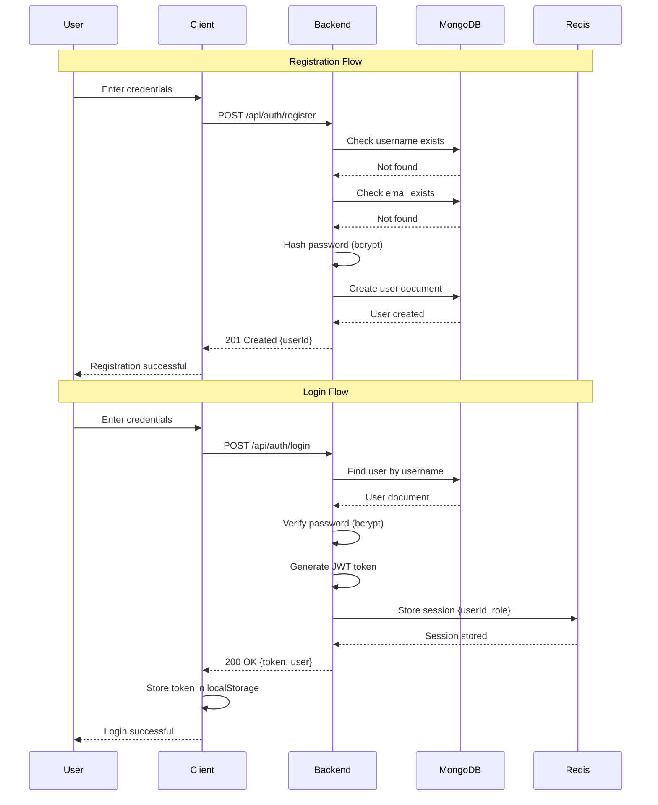
```mermaid
sequenceDiagram
    participant U as User
    participant C as Client
    participant B as Backend
    participant DB as MongoDB
    participant R as Redis

    Note over U,R: Registration Flow
    U->>C: Enter credentials
    C->>B: POST /api/auth/register
    B->>DB: Check username exists
    DB-->>B: Not found
    B->>DB: Check email exists
    DB-->>B: Not found
    B->>B: Hash password (bcrypt)
    B->>DB: Create user document
    DB-->>B: User created
    B-->>C: 201 Created {userId}
    C-->>U: Registration successful

    Note over U,R: Login Flow
    U->>C: Enter credentials
    C->>B: POST /api/auth/login
    B->>DB: Find user by username
    DB-->>B: User document
    B->>B: Verify password (bcrypt)
    B->>B: Generate JWT token
    B->>R: Store session {userId, role}
    R-->>B: Session stored
    B-->>C: 200 OK {token, user}
    C->>C: Store token in localStorage
    C-->>U: Login successful
```

### 2. Token Authentication Sequence

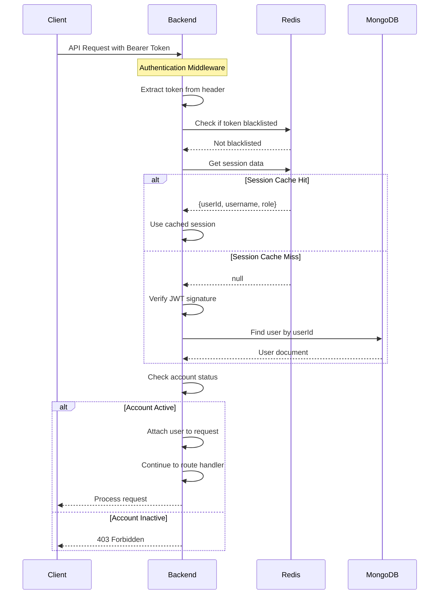
```mermaid
sequenceDiagram
    participant C as Client
    participant B as Backend
    participant R as Redis
    participant DB as MongoDB

    C->>B: API Request with Bearer Token
    
    Note over B: Authentication Middleware
    B->>B: Extract token from header
    
    B->>R: Check if token blacklisted
    R-->>B: Not blacklisted
    
    B->>R: Get session data
    alt Session Cache Hit
        R-->>B: {userId, username, role}
        B->>B: Use cached session
    else Session Cache Miss
        R-->>B: null
        B->>B: Verify JWT signature
        B->>DB: Find user by userId
        DB-->>B: User document
    end
    
    B->>B: Check account status
    alt Account Active
        B->>B: Attach user to request
        B->>B: Continue to route handler
        B-->>C: Process request
    else Account Inactive
        B-->>C: 403 Forbidden
    end
```

### 3. Complete Inspection Analysis Sequence

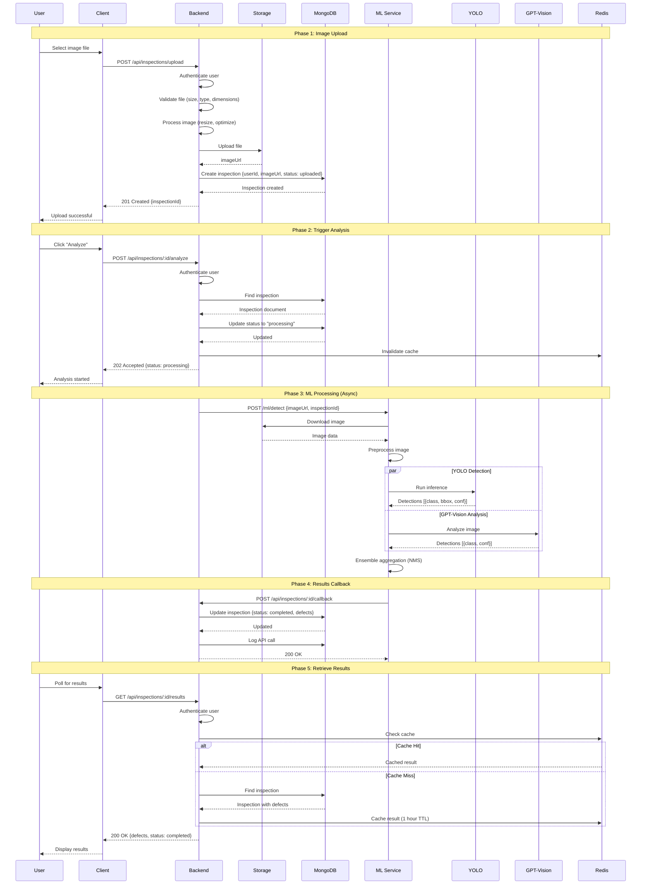
```mermaid
sequenceDiagram
    participant U as User
    participant C as Client
    participant B as Backend
    participant S as Storage
    participant DB as MongoDB
    participant ML as ML Service
    participant Y as YOLO
    participant G as GPT-Vision
    participant R as Redis

    Note over U,R: Phase 1: Image Upload
    U->>C: Select image file
    C->>B: POST /api/inspections/upload
    B->>B: Authenticate user
    B->>B: Validate file (size, type, dimensions)
    B->>B: Process image (resize, optimize)
    B->>S: Upload file
    S-->>B: imageUrl
    B->>DB: Create inspection {userId, imageUrl, status: uploaded}
    DB-->>B: Inspection created
    B-->>C: 201 Created {inspectionId}
    C-->>U: Upload successful

    Note over U,R: Phase 2: Trigger Analysis
    U->>C: Click "Analyze"
    C->>B: POST /api/inspections/:id/analyze
    B->>B: Authenticate user
    B->>DB: Find inspection
    DB-->>B: Inspection document
    B->>DB: Update status to "processing"
    DB-->>B: Updated
    B->>R: Invalidate cache
    B-->>C: 202 Accepted {status: processing}
    C-->>U: Analysis started

    Note over U,R: Phase 3: ML Processing (Async)
    B->>ML: POST /ml/detect {imageUrl, inspectionId}
    
    ML->>S: Download image
    S-->>ML: Image data
    ML->>ML: Preprocess image
    
    par YOLO Detection
        ML->>Y: Run inference
        Y-->>ML: Detections [{class, bbox, conf}]
    and GPT-Vision Analysis
        ML->>G: Analyze image
        G-->>ML: Detections [{class, conf}]
    end
    
    ML->>ML: Ensemble aggregation (NMS)
    
    Note over U,R: Phase 4: Results Callback
    ML->>B: POST /api/inspections/:id/callback
    B->>DB: Update inspection {status: completed, defects}
    DB-->>B: Updated
    B->>DB: Log API call
    B-->>ML: 200 OK

    Note over U,R: Phase 5: Retrieve Results
    U->>C: Poll for results
    C->>B: GET /api/inspections/:id/results
    B->>B: Authenticate user
    B->>R: Check cache
    alt Cache Hit
        R-->>B: Cached result
    else Cache Miss
        B->>DB: Find inspection
        DB-->>B: Inspection with defects
        B->>R: Cache result (1 hour TTL)
    end
    B-->>C: 200 OK {defects, status: completed}
    C-->>U: Display results
```

### 4. Admin Model Deployment Sequence

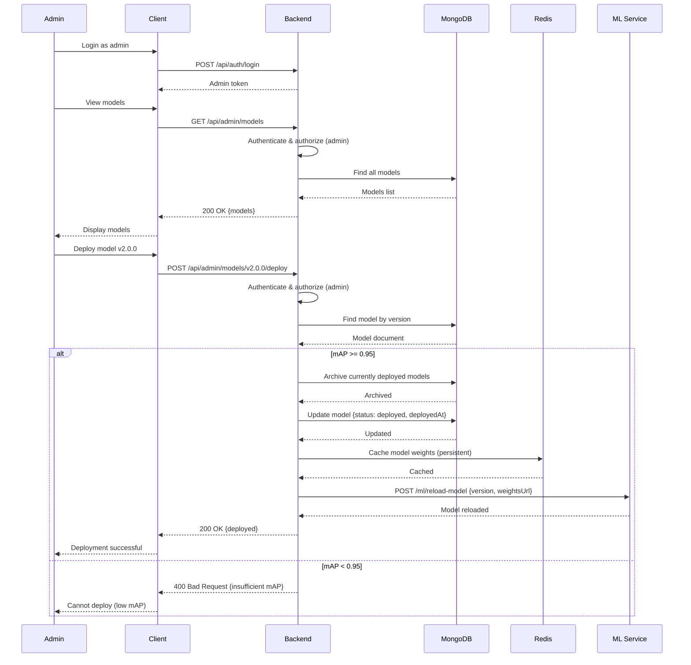
```mermaid
sequenceDiagram
    participant A as Admin
    participant C as Client
    participant B as Backend
    participant DB as MongoDB
    participant R as Redis
    participant ML as ML Service

    A->>C: Login as admin
    C->>B: POST /api/auth/login
    B-->>C: Admin token

    A->>C: View models
    C->>B: GET /api/admin/models
    B->>B: Authenticate & authorize (admin)
    B->>DB: Find all models
    DB-->>B: Models list
    B-->>C: 200 OK {models}
    C-->>A: Display models

    A->>C: Deploy model v2.0.0
    C->>B: POST /api/admin/models/v2.0.0/deploy
    B->>B: Authenticate & authorize (admin)
    B->>DB: Find model by version
    DB-->>B: Model document
    
    alt mAP >= 0.95
        B->>DB: Archive currently deployed models
        DB-->>B: Archived
        B->>DB: Update model {status: deployed, deployedAt}
        DB-->>B: Updated
        B->>R: Cache model weights (persistent)
        R-->>B: Cached
        B->>ML: POST /ml/reload-model {version, weightsUrl}
        ML-->>B: Model reloaded
        B-->>C: 200 OK {deployed}
        C-->>A: Deployment successful
    else mAP < 0.95
        B-->>C: 400 Bad Request {insufficient mAP}
        C-->>A: Cannot deploy (low mAP)
    end
```

### 5. User Logout Sequence

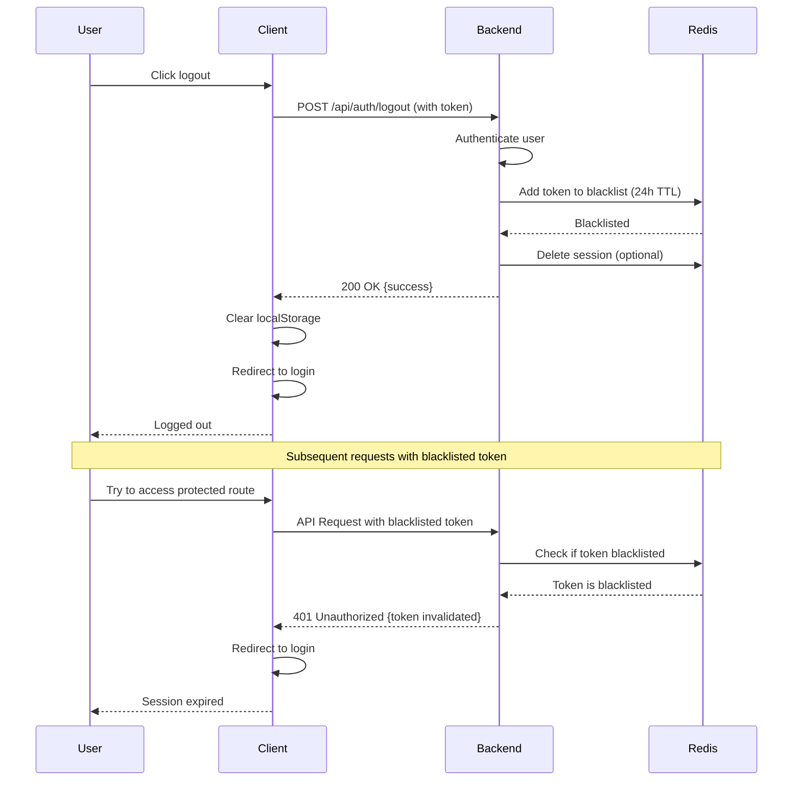
```mermaid
sequenceDiagram
    participant U as User
    participant C as Client
    participant B as Backend
    participant R as Redis

    U->>C: Click logout
    C->>B: POST /api/auth/logout (with token)
    B->>B: Authenticate user
    B->>R: Add token to blacklist (24h TTL)
    R-->>B: Blacklisted
    B->>R: Delete session (optional)
    B-->>C: 200 OK {success}
    C->>C: Clear localStorage
    C->>C: Redirect to login
    C-->>U: Logged out

    Note over U,R: Subsequent requests with blacklisted token
    U->>C: Try to access protected route
    C->>B: API Request with blacklisted token
    B->>R: Check if token blacklisted
    R-->>B: Token is blacklisted
    B-->>C: 401 Unauthorized {token invalidated}
    C->>C: Redirect to login
    C-->>U: Session expired
```

---

## Entity Relationship Diagrams

### 1. Complete Database Schema

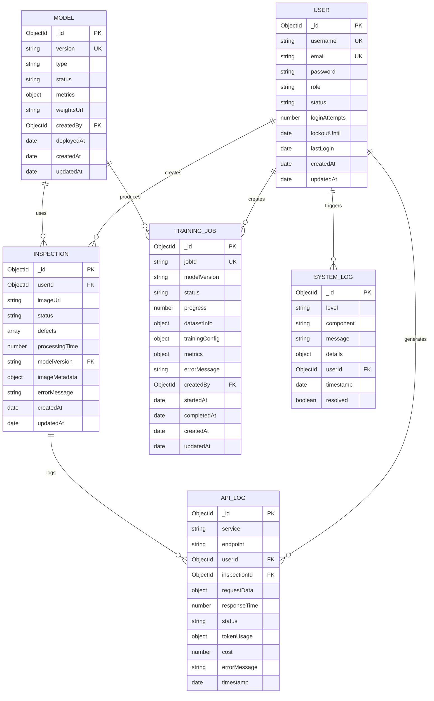
```mermaid
erDiagram
    USER ||--o{ INSPECTION : creates
    USER ||--o{ TRAINING_JOB : creates
    USER ||--o{ API_LOG : generates
    USER ||--o{ SYSTEM_LOG : triggers
    MODEL ||--o{ INSPECTION : uses
    MODEL ||--o{ TRAINING_JOB : produces
    INSPECTION ||--o{ API_LOG : logs
    
    USER {
        ObjectId _id PK
        string username UK
        string email UK
        string password
        string role
        string status
        number loginAttempts
        date lockoutUntil
        date lastLogin
        date createdAt
        date updatedAt
    }
    
    INSPECTION {
        ObjectId _id PK
        ObjectId userId FK
        string imageUrl
        string status
        array defects
        number processingTime
        string modelVersion FK
        object imageMetadata
        string errorMessage
        date createdAt
        date updatedAt
    }
    
    MODEL {
        ObjectId _id PK
        string version UK
        string type
        string status
        object metrics
        string weightsUrl
        ObjectId createdBy FK
        date deployedAt
        date createdAt
        date updatedAt
    }
    
    TRAINING_JOB {
        ObjectId _id PK
        string jobId UK
        string modelVersion
        string status
        number progress
        object datasetInfo
        object trainingConfig
        object metrics
        string errorMessage
        ObjectId createdBy FK
        date startedAt
        date completedAt
        date createdAt
        date updatedAt
    }
    
    API_LOG {
        ObjectId _id PK
        string service
        string endpoint
        ObjectId userId FK
        ObjectId inspectionId FK
        object requestData
        number responseTime
        string status
        object tokenUsage
        number cost
        string errorMessage
        date timestamp
    }
    
    SYSTEM_LOG {
        ObjectId _id PK
        string level
        string component
        string message
        object details
        ObjectId userId FK
        date timestamp
        boolean resolved
    }
```

### 2. Redis Cache Structure

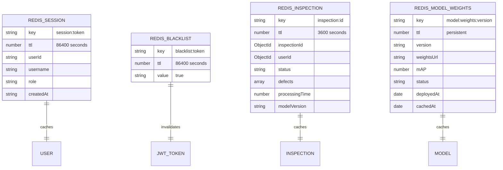
```mermaid
erDiagram
    REDIS_SESSION ||--|| USER : "caches"
    REDIS_BLACKLIST ||--|| JWT_TOKEN : "invalidates"
    REDIS_INSPECTION ||--|| INSPECTION : "caches"
    REDIS_MODEL_WEIGHTS ||--|| MODEL : "caches"
    
    REDIS_SESSION {
        string key "session:token"
        number ttl "86400 seconds"
        string userId
        string username
        string role
        string createdAt
    }
    
    REDIS_BLACKLIST {
        string key "blacklist:token"
        number ttl "86400 seconds"
        string value "true"
    }
    
    REDIS_INSPECTION {
        string key "inspection:id"
        number ttl "3600 seconds"
        ObjectId inspectionId
        ObjectId userId
        string status
        array defects
        number processingTime
        string modelVersion
    }
    
    REDIS_MODEL_WEIGHTS {
        string key "model:weights:version"
        number ttl "persistent"
        string version
        string weightsUrl
        number mAP
        string status
        date deployedAt
        date cachedAt
    }
```

---

## Flowcharts

### 1. Authentication Middleware Flow

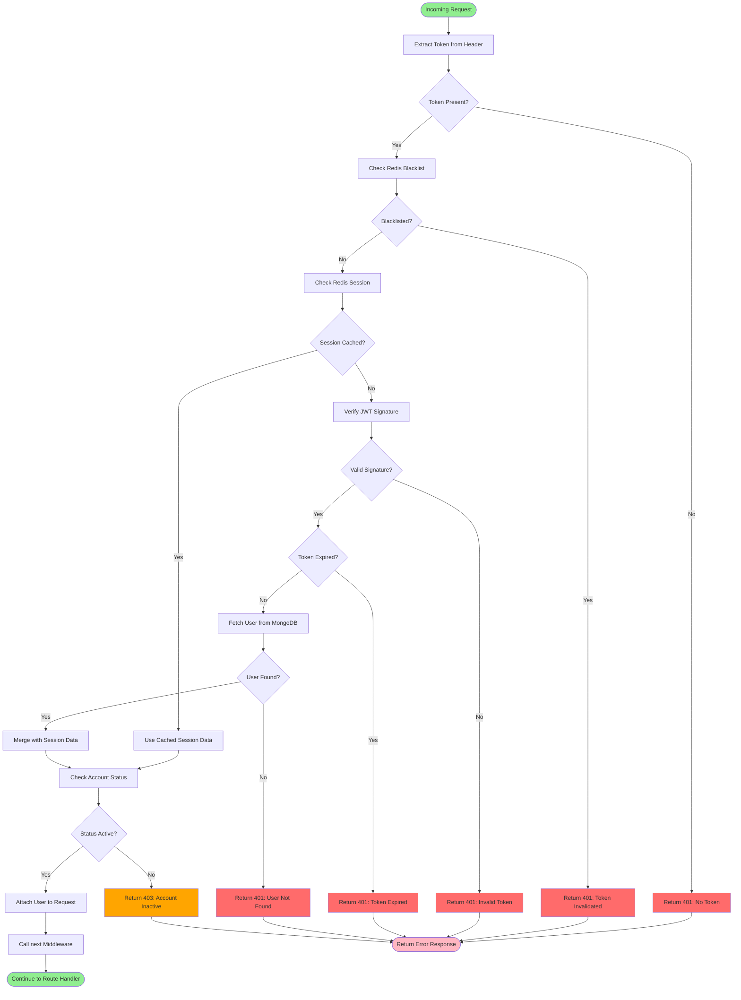
```mermaid
flowchart TD
    Start([Incoming Request]) --> ExtractToken[Extract Token from Header]
    ExtractToken --> HasToken{Token Present?}
    
    HasToken -->|No| Error401A[Return 401: No Token]
    HasToken -->|Yes| CheckBlacklist[Check Redis Blacklist]
    
    CheckBlacklist --> IsBlacklisted{Blacklisted?}
    IsBlacklisted -->|Yes| Error401B[Return 401: Token Invalidated]
    IsBlacklisted -->|No| CheckSession[Check Redis Session]
    
    CheckSession --> SessionExists{Session Cached?}
    SessionExists -->|Yes| UseCache[Use Cached Session Data]
    SessionExists -->|No| VerifyJWT[Verify JWT Signature]
    
    VerifyJWT --> JWTValid{Valid Signature?}
    JWTValid -->|No| Error401C[Return 401: Invalid Token]
    JWTValid -->|Yes| CheckExpiry{Token Expired?}
    
    CheckExpiry -->|Yes| Error401D[Return 401: Token Expired]
    CheckExpiry -->|No| FetchUser[Fetch User from MongoDB]
    
    FetchUser --> UserExists{User Found?}
    UserExists -->|No| Error401E[Return 401: User Not Found]
    UserExists -->|Yes| MergeData[Merge with Session Data]
    
    UseCache --> CheckStatus[Check Account Status]
    MergeData --> CheckStatus
    
    CheckStatus --> IsActive{Status Active?}
    IsActive -->|No| Error403[Return 403: Account Inactive]
    IsActive -->|Yes| AttachUser[Attach User to Request]
    
    AttachUser --> Next[Call next Middleware]
    Next --> End([Continue to Route Handler])
    
    Error401A --> EndError([Return Error Response])
    Error401B --> EndError
    Error401C --> EndError
    Error401D --> EndError
    Error401E --> EndError
    Error403 --> EndError
    
    style Start fill:#90EE90
    style End fill:#90EE90
    style EndError fill:#FFB6C1
    style Error401A fill:#FF6B6B
    style Error401B fill:#FF6B6B
    style Error401C fill:#FF6B6B
    style Error401D fill:#FF6B6B
    style Error401E fill:#FF6B6B
    style Error403 fill:#FFA500
```

### 2. Inspection Analysis Flow

```mermaid
flowchart TD
    Start([User Uploads Image]) --> Validate[Validate File]
    Validate --> ValidFile{Valid?}
    
    ValidFile -->|No| Error400A[Return 400: Invalid File]
    ValidFile -->|Yes| Process[Process Image]
    
    Process --> Upload[Upload to Storage]
    Upload --> CreateInspection[Create Inspection Record]
    CreateInspection --> SetUploaded[Set Status: uploaded]
    SetUploaded --> Return201[Return 201: Inspection Created]
    
    Return201 --> UserTrigger([User Triggers Analysis])
    UserTrigger --> CheckStatus{Status = uploaded?}
    
    CheckStatus -->|No| Error400B[Return 400: Invalid Status]
    CheckStatus -->|Yes| UpdateProcessing[Update Status: processing]
    
    UpdateProcessing --> InvalidateCache[Invalidate Redis Cache]
    InvalidateCache --> Return202[Return 202: Accepted]
    
    Return202 --> AsyncML[Async: Call ML Service]
    AsyncML --> DownloadImage[Download Image from Storage]
    DownloadImage --> Preprocess[Preprocess Image]
    
    Preprocess --> ParallelStart{Run Models in Parallel}
    
    ParallelStart --> YOLO[YOLO Detection]
    ParallelStart --> GPT[GPT-Vision Analysis]
    
    YOLO --> YOLOResults[YOLO Detections]
    GPT --> GPTResults[GPT Detections]
    
    YOLOResults --> Ensemble[Ensemble Aggregation]
    GPTResults --> Ensemble
    
    Ensemble --> NMS[Apply NMS]
    NMS --> FilterConf[Filter by Confidence]
    FilterConf --> MLSuccess{Success?}
    
    MLSuccess -->|Yes| Callback[Send Callback to Backend]
    MLSuccess -->|No| CallbackError[Send Error Callback]
    
    Callback --> UpdateCompleted[Update Status: completed]
    CallbackError --> UpdateFailed[Update Status: failed]
    
    UpdateCompleted --> CacheResults[Cache Results in Redis]
    UpdateFailed --> LogError[Log Error]
    
    CacheResults --> UserPoll([User Polls for Results])
    LogError --> UserPoll
    
    UserPoll --> CheckCache{Cache Hit?}
    CheckCache -->|Yes| ReturnCached[Return Cached Results]
    CheckCache -->|No| QueryDB[Query MongoDB]
    
    QueryDB --> CacheNew[Cache Results]
    CacheNew --> ReturnResults[Return Results]
    ReturnCached --> End([Display Results to User])
    ReturnResults --> End
    
    Error400A --> EndError([Error Response])
    Error400B --> EndError
    
    style Start fill:#90EE90
    style End fill:#90EE90
    style EndError fill:#FFB6C1
    style Error400A fill:#FF6B6B
    style Error400B fill:#FF6B6B
    style ParallelStart fill:#87CEEB
    style Ensemble fill:#DDA0DD
```

### 3. User Login Flow

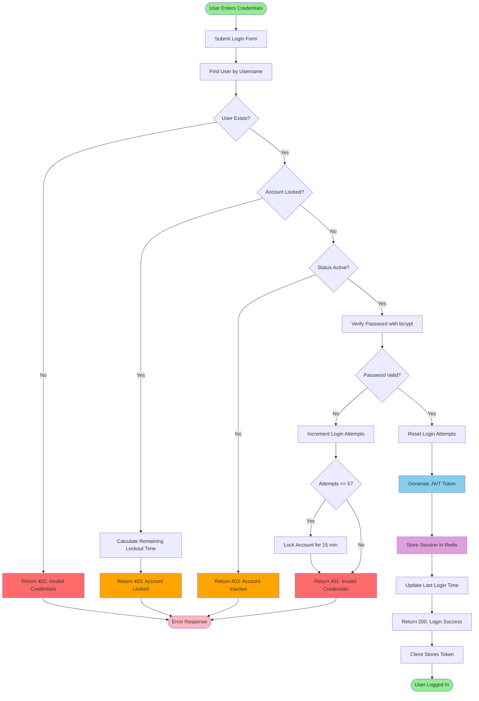
```mermaid
flowchart TD
    Start([User Enters Credentials]) --> Submit[Submit Login Form]
    Submit --> FindUser[Find User by Username]
    FindUser --> UserExists{User Exists?}
    
    UserExists -->|No| Error401A[Return 401: Invalid Credentials]
    UserExists -->|Yes| CheckLocked{Account Locked?}
    
    CheckLocked -->|Yes| CalcTime[Calculate Remaining Lockout Time]
    CalcTime --> Error403A[Return 403: Account Locked]
    CheckLocked -->|No| CheckStatus{Status Active?}
    
    CheckStatus -->|No| Error403B[Return 403: Account Inactive]
    CheckStatus -->|Yes| VerifyPassword[Verify Password with bcrypt]
    
    VerifyPassword --> PasswordValid{Password Valid?}
    
    PasswordValid -->|No| IncrementAttempts[Increment Login Attempts]
    IncrementAttempts --> CheckAttempts{Attempts >= 5?}
    CheckAttempts -->|Yes| LockAccount[Lock Account for 15 min]
    CheckAttempts -->|No| Error401B[Return 401: Invalid Credentials]
    LockAccount --> Error401B
    
    PasswordValid -->|Yes| ResetAttempts[Reset Login Attempts]
    ResetAttempts --> GenerateJWT[Generate JWT Token]
    GenerateJWT --> StoreSession[Store Session in Redis]
    StoreSession --> UpdateLastLogin[Update Last Login Time]
    UpdateLastLogin --> Return200[Return 200: Login Success]
    Return200 --> ClientStore[Client Stores Token]
    ClientStore --> End([User Logged In])
    
    Error401A --> EndError([Error Response])
    Error401B --> EndError
    Error403A --> EndError
    Error403B --> EndError
    
    style Start fill:#90EE90
    style End fill:#90EE90
    style EndError fill:#FFB6C1
    style Error401A fill:#FF6B6B
    style Error401B fill:#FF6B6B
    style Error403A fill:#FFA500
    style Error403B fill:#FFA500
    style GenerateJWT fill:#87CEEB
    style StoreSession fill:#DDA0DD
```

### 4. Model Deployment Decision Flow

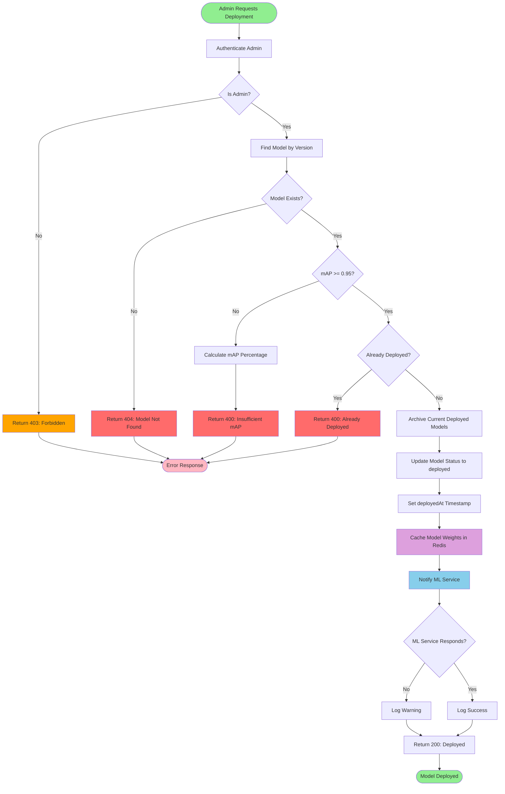
```mermaid
flowchart TD
    Start([Admin Requests Deployment]) --> Auth[Authenticate Admin]
    Auth --> IsAdmin{Is Admin?}
    
    IsAdmin -->|No| Error403[Return 403: Forbidden]
    IsAdmin -->|Yes| FindModel[Find Model by Version]
    
    FindModel --> ModelExists{Model Exists?}
    ModelExists -->|No| Error404[Return 404: Model Not Found]
    ModelExists -->|Yes| CheckMAP{mAP >= 0.95?}
    
    CheckMAP -->|No| CalcMAP[Calculate mAP Percentage]
    CalcMAP --> Error400[Return 400: Insufficient mAP]
    
    CheckMAP -->|Yes| CheckDeployed{Already Deployed?}
    CheckDeployed -->|Yes| Error400B[Return 400: Already Deployed]
    CheckDeployed -->|No| ArchiveOld[Archive Current Deployed Models]
    
    ArchiveOld --> UpdateStatus[Update Model Status to deployed]
    UpdateStatus --> SetDeployDate[Set deployedAt Timestamp]
    SetDeployDate --> CacheWeights[Cache Model Weights in Redis]
    CacheWeights --> NotifyML[Notify ML Service]
    
    NotifyML --> MLSuccess{ML Service Responds?}
    MLSuccess -->|No| LogWarning[Log Warning]
    MLSuccess -->|Yes| LogSuccess[Log Success]
    
    LogWarning --> Return200[Return 200: Deployed]
    LogSuccess --> Return200
    Return200 --> End([Model Deployed])
    
    Error403 --> EndError([Error Response])
    Error404 --> EndError
    Error400 --> EndError
    Error400B --> EndError
    
    style Start fill:#90EE90
    style End fill:#90EE90
    style EndError fill:#FFB6C1
    style Error403 fill:#FFA500
    style Error404 fill:#FF6B6B
    style Error400 fill:#FF6B6B
    style Error400B fill:#FF6B6B
    style CacheWeights fill:#DDA0DD
    style NotifyML fill:#87CEEB
```

### 5. Request Middleware Pipeline Flow

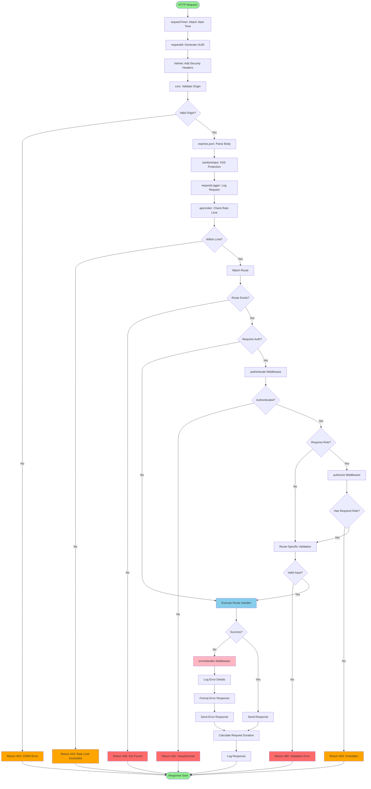
```mermaid
flowchart TD
    Start([HTTP Request]) --> Timer[requestTimer: Attach Start Time]
    Timer --> ReqID[requestId: Generate UUID]
    ReqID --> Helmet[helmet: Add Security Headers]
    Helmet --> CORS[cors: Validate Origin]
    
    CORS --> CORSValid{Valid Origin?}
    CORSValid -->|No| Error403A[Return 403: CORS Error]
    CORSValid -->|Yes| ParseBody[express.json: Parse Body]
    
    ParseBody --> Sanitize[sanitizeInput: XSS Protection]
    Sanitize --> ReqLogger[requestLogger: Log Request]
    ReqLogger --> RateLimit[apiLimiter: Check Rate Limit]
    
    RateLimit --> RateLimitOK{Within Limit?}
    RateLimitOK -->|No| Error429[Return 429: Rate Limit Exceeded]
    RateLimitOK -->|Yes| RouteMatch[Match Route]
    
    RouteMatch --> RouteFound{Route Exists?}
    RouteFound -->|No| Error404[Return 404: Not Found]
    RouteFound -->|Yes| NeedsAuth{Requires Auth?}
    
    NeedsAuth -->|No| RouteHandler[Execute Route Handler]
    NeedsAuth -->|Yes| Authenticate[authenticate Middleware]
    
    Authenticate --> AuthSuccess{Authenticated?}
    AuthSuccess -->|No| Error401[Return 401: Unauthorized]
    AuthSuccess -->|Yes| NeedsRole{Requires Role?}
    
    NeedsRole -->|No| Validate[Route-Specific Validation]
    NeedsRole -->|Yes| Authorize[authorize Middleware]
    
    Authorize --> HasRole{Has Required Role?}
    HasRole -->|No| Error403B[Return 403: Forbidden]
    HasRole -->|Yes| Validate
    
    Validate --> ValidInput{Valid Input?}
    ValidInput -->|No| Error400[Return 400: Validation Error]
    ValidInput -->|Yes| RouteHandler
    
    RouteHandler --> Success{Success?}
    Success -->|No| ErrorHandler[errorHandler Middleware]
    Success -->|Yes| SendResponse[Send Response]
    
    ErrorHandler --> LogError[Log Error Details]
    LogError --> FormatError[Format Error Response]
    FormatError --> SendError[Send Error Response]
    
    SendResponse --> CalcDuration[Calculate Request Duration]
    SendError --> CalcDuration
    CalcDuration --> LogResponse[Log Response]
    LogResponse --> End([Response Sent])
    
    Error403A --> End
    Error429 --> End
    Error404 --> End
    Error401 --> End
    Error403B --> End
    Error400 --> End
    
    style Start fill:#90EE90
    style End fill:#90EE90
    style Error403A fill:#FFA500
    style Error429 fill:#FFA500
    style Error404 fill:#FF6B6B
    style Error401 fill:#FF6B6B
    style Error403B fill:#FFA500
    style Error400 fill:#FF6B6B
    style RouteHandler fill:#87CEEB
    style ErrorHandler fill:#FFB6C1
```

### 6. Cache Strategy Decision Flow

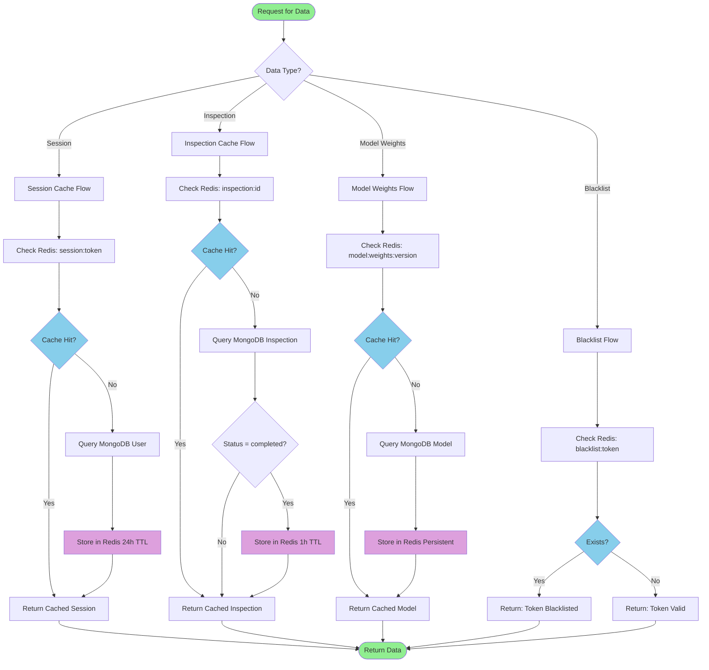
```mermaid
flowchart TD
    Start([Request for Data]) --> CheckType{Data Type?}
    
    CheckType -->|Session| SessionFlow[Session Cache Flow]
    CheckType -->|Inspection| InspectionFlow[Inspection Cache Flow]
    CheckType -->|Model Weights| ModelFlow[Model Weights Flow]
    CheckType -->|Blacklist| BlacklistFlow[Blacklist Flow]
    
    SessionFlow --> CheckSession[Check Redis: session:token]
    CheckSession --> SessionHit{Cache Hit?}
    SessionHit -->|Yes| ReturnSession[Return Cached Session]
    SessionHit -->|No| QueryUser[Query MongoDB User]
    QueryUser --> StoreSession[Store in Redis 24h TTL]
    StoreSession --> ReturnSession
    
    InspectionFlow --> CheckInspection[Check Redis: inspection:id]
    CheckInspection --> InspectionHit{Cache Hit?}
    InspectionHit -->|Yes| ReturnInspection[Return Cached Inspection]
    InspectionHit -->|No| QueryInspection[Query MongoDB Inspection]
    QueryInspection --> CheckComplete{Status = completed?}
    CheckComplete -->|Yes| StoreInspection[Store in Redis 1h TTL]
    CheckComplete -->|No| ReturnInspection
    StoreInspection --> ReturnInspection
    
    ModelFlow --> CheckModel[Check Redis: model:weights:version]
    CheckModel --> ModelHit{Cache Hit?}
    ModelHit -->|Yes| ReturnModel[Return Cached Model]
    ModelHit -->|No| QueryModel[Query MongoDB Model]
    QueryModel --> StoreModel[Store in Redis Persistent]
    StoreModel --> ReturnModel
    
    BlacklistFlow --> CheckBlacklist[Check Redis: blacklist:token]
    CheckBlacklist --> BlacklistHit{Exists?}
    BlacklistHit -->|Yes| ReturnBlacklisted[Return: Token Blacklisted]
    BlacklistHit -->|No| ReturnValid[Return: Token Valid]
    
    ReturnSession --> End([Return Data])
    ReturnInspection --> End
    ReturnModel --> End
    ReturnBlacklisted --> End
    ReturnValid --> End
    
    style Start fill:#90EE90
    style End fill:#90EE90
    style SessionHit fill:#87CEEB
    style InspectionHit fill:#87CEEB
    style ModelHit fill:#87CEEB
    style BlacklistHit fill:#87CEEB
    style StoreSession fill:#DDA0DD
    style StoreInspection fill:#DDA0DD
    style StoreModel fill:#DDA0DD
```

### 7. ML Ensemble Processing Flow

```mermaid
flowchart TD
    Start([ML Service Receives Request]) --> Download[Download Image from Storage]
    Download --> DownloadSuccess{Download Success?}
    
    DownloadSuccess -->|No| ErrorDownload[Return Error: Download Failed]
    DownloadSuccess -->|Yes| Preprocess[Preprocess Image]
    
    Preprocess --> Resize[Resize to 640x640]
    Resize --> Normalize[Normalize Pixel Values]
    Normalize --> Convert[Convert Format]
    Convert --> ParallelStart{Run Models in Parallel}
    
    ParallelStart --> YOLOPath[YOLO Path]
    ParallelStart --> GPTPath[GPT-Vision Path]
    
    YOLOPath --> LoadYOLO[Load YOLOv8n Model]
    LoadYOLO --> RunYOLO[Run Inference]
    RunYOLO --> YOLOConf[Filter by Confidence 0.5]
    YOLOConf --> YOLONMS[Apply NMS IOU 0.45]
    YOLONMS --> YOLOResults[YOLO Detections]
    
    GPTPath --> PreparePrompt[Prepare Detection Prompt]
    PreparePrompt --> CallGPT[Call OpenAI API]
    CallGPT --> GPTSuccess{API Success?}
    GPTSuccess -->|No| GPTError[Log GPT Error]
    GPTSuccess -->|Yes| ParseGPT[Parse GPT Response]
    ParseGPT --> GPTResults[GPT Detections]
    GPTError --> GPTResults
    
    YOLOResults --> Aggregate[Aggregate Detections]
    GPTResults --> Aggregate
    
    Aggregate --> ApplyWeights[Apply Ensemble Weights]
    ApplyWeights --> WeightCalc[YOLO: 0.6, GPT: 0.4]
    WeightCalc --> EnsembleNMS[Apply Ensemble NMS 0.5]
    EnsembleNMS --> FilterMinConf[Filter Min Confidence 0.5]
    FilterMinConf --> FormatResults[Format Final Results]
    
    FormatResults --> CalcMetrics[Calculate Metrics]
    CalcMetrics --> LogTokens[Log Token Usage]
    LogTokens --> CalcCost[Calculate Cost]
    CalcCost --> SendCallback[Send Callback to Backend]
    
    SendCallback --> CallbackSuccess{Callback Success?}
    CallbackSuccess -->|Yes| End([Processing Complete])
    CallbackSuccess -->|No| RetryCallback[Retry Callback]
    RetryCallback --> RetrySuccess{Retry Success?}
    RetrySuccess -->|Yes| End
    RetrySuccess -->|No| LogCallbackError[Log Callback Error]
    LogCallbackError --> End
    
    ErrorDownload --> EndError([Error Response])
    
    style Start fill:#90EE90
    style End fill:#90EE90
    style EndError fill:#FFB6C1
    style ParallelStart fill:#87CEEB
    style Aggregate fill:#DDA0DD
    style ApplyWeights fill:#FFD700
    style EnsembleNMS fill:#FFD700
```

### 8. File Upload Validation Flow

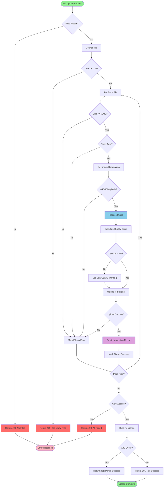
```mermaid
flowchart TD
    Start([File Upload Request]) --> CheckFiles{Files Present?}
    
    CheckFiles -->|No| Error400A[Return 400: No Files]
    CheckFiles -->|Yes| CountFiles[Count Files]
    
    CountFiles --> CheckCount{Count <= 10?}
    CheckCount -->|No| Error400B[Return 400: Too Many Files]
    CheckCount -->|Yes| LoopStart[For Each File]
    
    LoopStart --> CheckSize{Size <= 50MB?}
    CheckSize -->|No| MarkError[Mark File as Error]
    CheckSize -->|Yes| CheckType{Valid Type?}
    
    CheckType -->|No| MarkError
    CheckType -->|Yes| CheckDimensions[Get Image Dimensions]
    
    CheckDimensions --> DimValid{640-4096 pixels?}
    DimValid -->|No| MarkError
    DimValid -->|Yes| ProcessImage[Process Image]
    
    ProcessImage --> CalcQuality[Calculate Quality Score]
    CalcQuality --> QualityCheck{Quality >= 60?}
    QualityCheck -->|No| LogWarning[Log Low Quality Warning]
    QualityCheck -->|Yes| UploadFile[Upload to Storage]
    LogWarning --> UploadFile
    
    UploadFile --> UploadSuccess{Upload Success?}
    UploadSuccess -->|No| MarkError
    UploadSuccess -->|Yes| CreateRecord[Create Inspection Record]
    
    CreateRecord --> MarkSuccess[Mark File as Success]
    MarkSuccess --> MoreFiles{More Files?}
    MarkError --> MoreFiles
    
    MoreFiles -->|Yes| LoopStart
    MoreFiles -->|No| CheckResults{Any Success?}
    
    CheckResults -->|No| Error400C[Return 400: All Failed]
    CheckResults -->|Yes| BuildResponse[Build Response]
    
    BuildResponse --> HasErrors{Any Errors?}
    HasErrors -->|Yes| Return201Partial[Return 201: Partial Success]
    HasErrors -->|No| Return201Full[Return 201: Full Success]
    
    Return201Partial --> End([Upload Complete])
    Return201Full --> End
    
    Error400A --> EndError([Error Response])
    Error400B --> EndError
    Error400C --> EndError
    
    style Start fill:#90EE90
    style End fill:#90EE90
    style EndError fill:#FFB6C1
    style Error400A fill:#FF6B6B
    style Error400B fill:#FF6B6B
    style Error400C fill:#FF6B6B
    style ProcessImage fill:#87CEEB
    style CreateRecord fill:#DDA0DD
```

---

## System State Diagrams

### Inspection Status State Machine

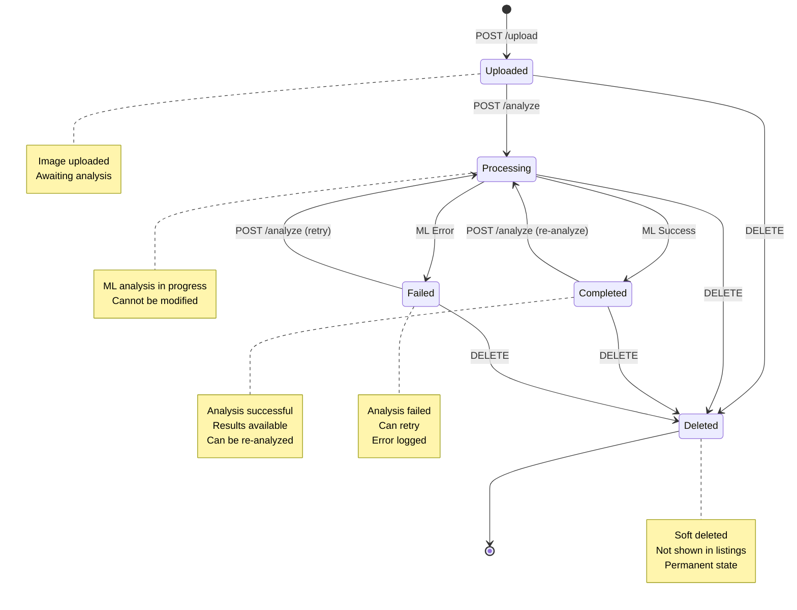
```mermaid
stateDiagram-v2
    [*] --> Uploaded: POST /upload
    
    Uploaded --> Processing: POST /analyze
    Uploaded --> Deleted: DELETE
    
    Processing --> Completed: ML Success
    Processing --> Failed: ML Error
    Processing --> Deleted: DELETE
    
    Completed --> Processing: POST /analyze (re-analyze)
    Completed --> Deleted: DELETE
    
    Failed --> Processing: POST /analyze (retry)
    Failed --> Deleted: DELETE
    
    Deleted --> [*]
    
    note right of Uploaded
        Image uploaded
        Awaiting analysis
    end note
    
    note right of Processing
        ML analysis in progress
        Cannot be modified
    end note
    
    note right of Completed
        Analysis successful
        Results available
        Can be re-analyzed
    end note
    
    note right of Failed
        Analysis failed
        Can retry
        Error logged
    end note
    
    note right of Deleted
        Soft deleted
        Not shown in listings
        Permanent state
    end note
```

### Model Status State Machine

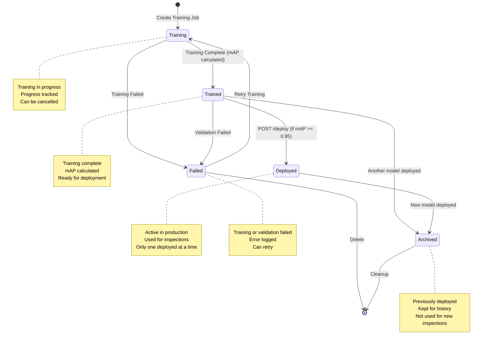
```mermaid
stateDiagram-v2
    [*] --> Training: Create Training Job
    
    Training --> Trained: Training Complete (mAP calculated)
    Training --> Failed: Training Failed
    
    Trained --> Deployed: POST /deploy (if mAP >= 0.95)
    Trained --> Archived: Another model deployed
    Trained --> Failed: Validation Failed
    
    Deployed --> Archived: New model deployed
    
    Failed --> Training: Retry Training
    Failed --> [*]: Delete
    
    Archived --> [*]: Cleanup
    
    note right of Training
        Training in progress
        Progress tracked
        Can be cancelled
    end note
    
    note right of Trained
        Training complete
        mAP calculated
        Ready for deployment
    end note
    
    note right of Deployed
        Active in production
        Used for inspections
        Only one deployed at a time
    end note
    
    note right of Archived
        Previously deployed
        Kept for history
        Not used for new inspections
    end note
    
    note right of Failed
        Training or validation failed
        Error logged
        Can retry
    end note
```

---

## Component Interaction Diagram

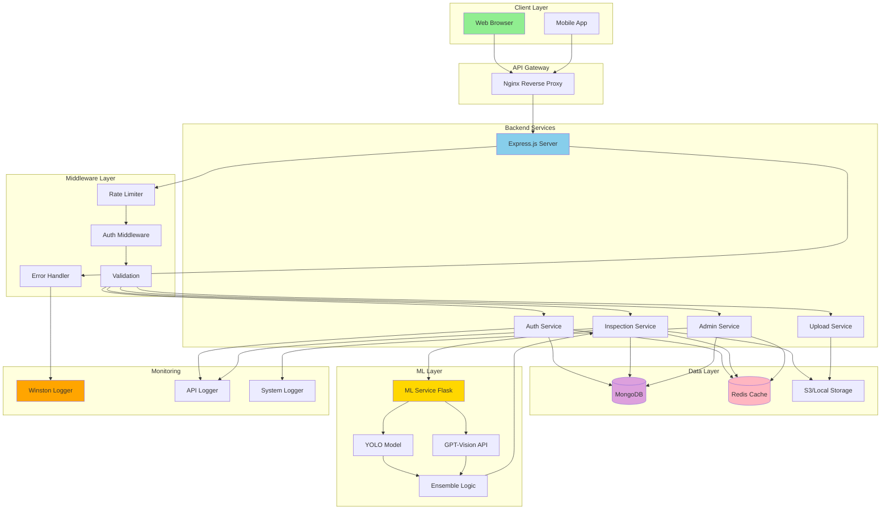
```mermaid
graph TB
    subgraph Client Layer
        Browser[Web Browser]
        Mobile[Mobile App]
    end
    
    subgraph API Gateway
        Nginx[Nginx Reverse Proxy]
    end
    
    subgraph Backend Services
        Express[Express.js Server]
        Auth[Auth Service]
        Inspection[Inspection Service]
        Admin[Admin Service]
        Upload[Upload Service]
    end
    
    subgraph Middleware Layer
        RateLimit[Rate Limiter]
        AuthMW[Auth Middleware]
        Validation[Validation]
        ErrorHandler[Error Handler]
    end
    
    subgraph Data Layer
        MongoDB[(MongoDB)]
        Redis[(Redis Cache)]
        S3[S3/Local Storage]
    end
    
    subgraph ML Layer
        MLService[ML Service Flask]
        YOLO[YOLO Model]
        GPT[GPT-Vision API]
        Ensemble[Ensemble Logic]
    end
    
    subgraph Monitoring
        Logger[Winston Logger]
        ApiLog[API Logger]
        SysLog[System Logger]
    end
    
    Browser --> Nginx
    Mobile --> Nginx
    Nginx --> Express
    
    Express --> RateLimit
    RateLimit --> AuthMW
    AuthMW --> Validation
    Validation --> Auth
    Validation --> Inspection
    Validation --> Admin
    Validation --> Upload
    
    Auth --> MongoDB
    Auth --> Redis
    Inspection --> MongoDB
    Inspection --> Redis
    Inspection --> S3
    Admin --> MongoDB
    Admin --> Redis
    Upload --> S3
    
    Inspection --> MLService
    MLService --> YOLO
    MLService --> GPT
    YOLO --> Ensemble
    GPT --> Ensemble
    Ensemble --> Inspection
    
    Express --> ErrorHandler
    ErrorHandler --> Logger
    Auth --> ApiLog
    Inspection --> ApiLog
    Admin --> SysLog
    
    style Browser fill:#90EE90
    style Express fill:#87CEEB
    style MongoDB fill:#DDA0DD
    style Redis fill:#FFB6C1
    style MLService fill:#FFD700
    style Logger fill:#FFA500
```

---

## Data Flow Architecture

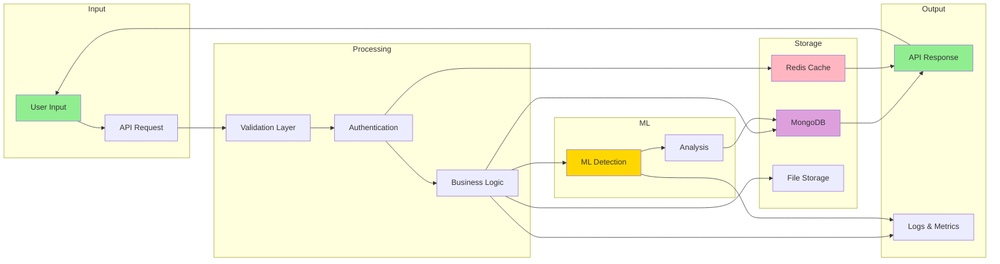
```mermaid
graph LR
    subgraph Input
        User[User Input]
        API[API Request]
    end
    
    subgraph Processing
        Validate[Validation Layer]
        Auth[Authentication]
        Business[Business Logic]
    end
    
    subgraph Storage
        Cache[Redis Cache]
        DB[MongoDB]
        Files[File Storage]
    end
    
    subgraph ML
        Detect[ML Detection]
        Analyze[Analysis]
    end
    
    subgraph Output
        Response[API Response]
        Logs[Logs & Metrics]
    end
    
    User --> API
    API --> Validate
    Validate --> Auth
    Auth --> Cache
    Auth --> Business
    Business --> DB
    Business --> Files
    Business --> Detect
    Detect --> Analyze
    Analyze --> DB
    DB --> Response
    Cache --> Response
    Business --> Logs
    Detect --> Logs
    Response --> User
    
    style User fill:#90EE90
    style Response fill:#90EE90
    style Cache fill:#FFB6C1
    style DB fill:#DDA0DD
    style Detect fill:#FFD700
```

---

## Related Documentation

- [Complete Dataflow Documentation](./DATAFLOW_AND_TOKEN_RESOLUTION.md)
- [Visual Dataflow Diagrams](./DATAFLOW_DIAGRAMS.md)
- [API Documentation](../03-api-documentation/API_DOCUMENTATION.md)
- [Security Implementation](../04-security/SECURITY_IMPLEMENTATION.md)

---

## How to View These Diagrams

### In GitHub
GitHub automatically renders Mermaid diagrams in markdown files. Simply view this file on GitHub to see all diagrams rendered.

### In VS Code
Install the "Markdown Preview Mermaid Support" extension to view diagrams in VS Code's markdown preview.

### In Other Editors
Use any markdown viewer that supports Mermaid syntax, or copy the diagram code to [Mermaid Live Editor](https://mermaid.live/) for interactive viewing and editing.

### Export Options
You can export these diagrams as:
- PNG/SVG images using Mermaid Live Editor
- PDF using markdown-to-pdf converters
- HTML using markdown processors with Mermaid support
