# Aircraft Defect Detection System - Unified Sequence Diagram

This document contains a comprehensive, all-in-one sequence diagram showing the complete system flow from user registration through inspection analysis.

---

## Complete System Flow - Unified Sequence Diagram

This diagram shows the entire user journey through the system, including:
- User Registration
- User Login with Token Management
- Image Upload
- ML Analysis Trigger
- Asynchronous ML Processing
- Results Retrieval with Caching
- User Logout

```mermaid
sequenceDiagram
    participant U as User
    participant C as Client/Browser
    participant B as Backend/Express
    participant MW as Middleware
    participant DB as MongoDB
    participant R as Redis Cache
    participant S as Storage (S3/Local)
    participant ML as ML Service
    participant Y as YOLO Model
    participant G as GPT-Vision

    rect rgb(200, 255, 200)
    Note over U,G: PHASE 1: USER REGISTRATION
    U->>C: Enter registration details
    C->>B: POST /api/auth/register<br/>{username, email, password}
    B->>MW: Rate limit check (10 req/15min)
    MW-->>B: OK
    B->>B: Validate input (username 3-30 chars,<br/>email format, password complexity)
    B->>DB: Check username exists
    DB-->>B: Not found
    B->>DB: Check email exists
    DB-->>B: Not found
    B->>B: Hash password (bcrypt, 10 rounds)
    B->>DB: Create user {username, email,<br/>hashedPassword, role: user, status: active}
    DB-->>B: User created {userId}
    B-->>C: 201 Created {success, userId}
    C-->>U: Registration successful
    end

    rect rgb(200, 220, 255)
    Note over U,G: PHASE 2: USER LOGIN & TOKEN GENERATION
    U->>C: Enter login credentials
    C->>B: POST /api/auth/login<br/>{username, password}
    B->>MW: Rate limit check (10 req/15min)
    MW-->>B: OK
    B->>DB: Find user by username
    DB-->>B: User document
    B->>B: Check account locked?
    alt Account Locked
        B-->>C: 403 Forbidden<br/>{ACCOUNT_LOCKED, lockout time}
        C-->>U: Account locked, try later
    else Account Active
        B->>B: Check account status = active?
        alt Status Inactive
            B-->>C: 403 Forbidden<br/>{ACCOUNT_INACTIVE}
            C-->>U: Account deactivated
        else Status Active
            B->>B: Verify password (bcrypt.compare)
            alt Password Invalid
                B->>DB: Increment login attempts
                DB-->>B: Updated (attempts++)
                alt Attempts >= 5
                    B->>DB: Lock account (15 min)
                    DB-->>B: Account locked
                end
                B-->>C: 401 Unauthorized<br/>{INVALID_CREDENTIALS}
                C-->>U: Invalid credentials
            else Password Valid
                B->>DB: Reset login attempts to 0
                DB-->>B: Reset complete
                B->>B: Generate JWT token<br/>{userId, username, role}<br/>Secret: JWT_SECRET<br/>Expiry: 24h
                B->>R: Store session<br/>Key: session:{token}<br/>Value: {userId, username, role}<br/>TTL: 86400 sec (24h)
                R-->>B: Session stored
                B->>DB: Update lastLogin timestamp
                DB-->>B: Updated
                B-->>C: 200 OK<br/>{token, user: {id, username, email, role}}
                C->>C: Store token in localStorage
                C-->>U: Login successful, redirect to dashboard
            end
        end
    end
    end

    rect rgb(255, 240, 200)
    Note over U,G: PHASE 3: IMAGE UPLOAD
    U->>C: Select aircraft image file
    C->>B: POST /api/inspections/upload<br/>Authorization: Bearer {token}<br/>Content-Type: multipart/form-data<br/>images: [file]
    B->>MW: Rate limit check (20 req/min)
    MW-->>B: OK
    
    Note over B,R: Authentication Process
    B->>MW: authenticate() middleware
    MW->>MW: Extract token from header
    MW->>R: Check blacklist:{token}
    R-->>MW: Not blacklisted
    MW->>R: Get session:{token}
    alt Session Cache Hit
        R-->>MW: {userId, username, role}
        MW->>MW: Use cached session
    else Session Cache Miss
        R-->>MW: null
        MW->>MW: Verify JWT signature
        MW->>DB: Find user by userId from JWT
        DB-->>MW: User document
    end
    MW->>MW: Check account status = active
    MW->>MW: Attach user to req.user
    MW-->>B: Authentication successful
    
    B->>B: Validate file<br/>- Size <= 50MB<br/>- Type: jpeg/png/tiff<br/>- Dimensions: 640-4096px
    alt File Invalid
        B-->>C: 400 Bad Request<br/>{FILE_TOO_LARGE or INVALID_TYPE}
        C-->>U: Upload failed
    else File Valid
        B->>B: Process image<br/>- Resize if needed<br/>- Optimize<br/>- Calculate quality score
        B->>S: Upload file to storage
        S-->>B: imageUrl
        B->>DB: Create inspection<br/>{userId, imageUrl, status: uploaded,<br/>imageMetadata: {filename, size, dimensions}}
        DB-->>B: Inspection created {inspectionId}
        B-->>C: 201 Created<br/>{inspectionId, filename, qualityScore}
        C-->>U: Upload successful, ready to analyze
    end
    end

    rect rgb(255, 220, 255)
    Note over U,G: PHASE 4: TRIGGER ML ANALYSIS
    U->>C: Click "Analyze" button
    C->>B: POST /api/inspections/{id}/analyze<br/>Authorization: Bearer {token}
    B->>MW: Authenticate (same process as above)
    MW-->>B: Authenticated
    B->>DB: Find inspection by id
    DB-->>B: Inspection document
    B->>B: Check ownership<br/>(userId matches or admin role)
    alt Not Authorized
        B-->>C: 403 Forbidden<br/>{FORBIDDEN}
        C-->>U: Access denied
    else Authorized
        B->>B: Check status = uploaded
        alt Status Not Uploaded
            B-->>C: 400 Bad Request<br/>{INVALID_STATUS}
            C-->>U: Cannot analyze (wrong status)
        else Status Uploaded
            B->>DB: Update inspection<br/>{status: processing}
            DB-->>B: Updated
            B->>R: Invalidate cache<br/>Delete inspection:{id}
            R-->>B: Cache invalidated
            B-->>C: 202 Accepted<br/>{status: processing, message: Analysis started}
            C-->>U: Analysis in progress, please wait
            
            Note over B,G: Async ML Processing (Fire & Forget)
            B->>ML: POST /ml/detect<br/>{imageUrl, inspectionId}<br/>Timeout: 60 sec
        end
    end
    end

    rect rgb(220, 255, 255)
    Note over U,G: PHASE 5: ML PROCESSING (ASYNCHRONOUS)
    ML->>S: Download image from imageUrl
    S-->>ML: Image binary data
    ML->>ML: Preprocess image<br/>- Resize to 640x640<br/>- Normalize pixels<br/>- Convert format
    
    par Parallel ML Processing
        ML->>Y: YOLO Detection<br/>- Load YOLOv8n model<br/>- Run inference<br/>- Confidence threshold: 0.5<br/>- NMS IOU: 0.45
        Y-->>ML: YOLO detections<br/>[{class, bbox, confidence}]
    and
        ML->>G: GPT-Vision Analysis<br/>- Prepare prompt<br/>- Call OpenAI API<br/>- Model: gpt-4-vision-preview<br/>- Max tokens: 1000
        G-->>ML: GPT detections<br/>[{class, confidence}]
    end
    
    ML->>ML: Ensemble Aggregation<br/>- Apply weights (YOLO: 0.6, GPT: 0.4)<br/>- Combine detections<br/>- Apply NMS (IOU: 0.5)<br/>- Filter min confidence: 0.5
    ML->>ML: Calculate metrics<br/>- Processing time<br/>- Token usage<br/>- Cost estimation
    
    alt ML Processing Success
        ML->>B: POST /api/inspections/{id}/callback<br/>{success: true, data: {defects, processingTime, metadata}}
        B->>DB: Update inspection<br/>{status: completed, defects: [...],<br/>processingTime, modelVersion}
        DB-->>B: Updated
        B->>DB: Create ApiLog<br/>{service: ensemble, status: success,<br/>responseTime, tokenUsage, cost}
        DB-->>B: Logged
        B-->>ML: 200 OK
    else ML Processing Failed
        ML->>B: POST /api/inspections/{id}/callback<br/>{success: false, error: message}
        B->>DB: Update inspection<br/>{status: failed, errorMessage}
        DB-->>B: Updated
        B->>DB: Create ApiLog<br/>{service: ensemble, status: error,<br/>errorMessage}
        DB-->>B: Logged
        B-->>ML: 200 OK
    end
    end

    rect rgb(255, 255, 200)
    Note over U,G: PHASE 6: RETRIEVE RESULTS (WITH CACHING)
    U->>C: Poll for results (every 2-3 seconds)
    C->>B: GET /api/inspections/{id}/results<br/>Authorization: Bearer {token}
    B->>MW: Authenticate
    MW-->>B: Authenticated
    
    B->>R: Check cache<br/>Get inspection:{id}
    alt Cache Hit
        R-->>B: Cached inspection result
        B->>B: Verify user ownership
        B-->>C: 200 OK<br/>{data: inspection, cached: true}
        C-->>U: Display results (from cache)
    else Cache Miss
        R-->>B: null
        B->>DB: Find inspection by id
        DB-->>B: Inspection document
        B->>B: Verify user ownership
        
        alt Status = processing
            B-->>C: 200 OK<br/>{status: processing, message: Still analyzing}
            C-->>U: Still processing, continue polling
        else Status = failed
            B-->>C: 200 OK<br/>{status: failed, errorMessage}
            C-->>U: Analysis failed, show error
        else Status = completed
            B->>R: Cache result<br/>Set inspection:{id}<br/>TTL: 3600 sec (1 hour)
            R-->>B: Cached
            B-->>C: 200 OK<br/>{data: {defects, processingTime,<br/>modelVersion}, cached: false}
            C->>C: Stop polling
            C-->>U: Display defect results<br/>- Show bounding boxes<br/>- List defects with confidence<br/>- Show processing time
        end
    end
    end

    rect rgb(255, 200, 200)
    Note over U,G: PHASE 7: USER LOGOUT
    U->>C: Click logout button
    C->>B: POST /api/auth/logout<br/>Authorization: Bearer {token}
    B->>MW: Authenticate
    MW-->>B: Authenticated
    B->>R: Add to blacklist<br/>Set blacklist:{token}<br/>Value: true<br/>TTL: 86400 sec (24h)
    R-->>B: Token blacklisted
    B->>R: Delete session:{token} (optional)
    R-->>B: Session deleted
    B-->>C: 200 OK<br/>{success: true, message: Logout successful}
    C->>C: Clear localStorage<br/>Remove token
    C->>C: Redirect to login page
    C-->>U: Logged out successfully
    end

    rect rgb(240, 240, 240)
    Note over U,G: SUBSEQUENT REQUEST WITH BLACKLISTED TOKEN
    U->>C: Try to access protected route
    C->>B: GET /api/inspections<br/>Authorization: Bearer {blacklisted_token}
    B->>MW: authenticate() middleware
    MW->>R: Check blacklist:{token}
    R-->>MW: Token is blacklisted
    MW-->>B: Authentication failed
    B-->>C: 401 Unauthorized<br/>{TOKEN_INVALIDATED}
    C->>C: Redirect to login
    C-->>U: Session expired, please login
    end
```

---

## Diagram Legend

### Color Coding
- **Green (rgb(200, 255, 200))**: Registration phase
- **Blue (rgb(200, 220, 255))**: Login and authentication
- **Orange (rgb(255, 240, 200))**: Image upload
- **Purple (rgb(255, 220, 255))**: Analysis trigger
- **Cyan (rgb(220, 255, 255))**: ML processing
- **Yellow (rgb(255, 255, 200))**: Results retrieval
- **Red (rgb(255, 200, 200))**: Logout
- **Gray (rgb(240, 240, 240))**: Blacklisted token handling

### Participants
- **U**: End User
- **C**: Client/Browser (Frontend)
- **B**: Backend Server (Express.js)
- **MW**: Middleware Layer (Auth, Validation, Rate Limiting)
- **DB**: MongoDB Database
- **R**: Redis Cache
- **S**: Storage (AWS S3 or Local Filesystem)
- **ML**: ML Service (Python/Flask)
- **Y**: YOLO Model
- **G**: GPT-Vision API

### Key Flows

1. **Registration**: User creates account with validation
2. **Login**: JWT token generation with Redis session caching
3. **Authentication**: Token verification with cache-first strategy
4. **Upload**: File validation and storage
5. **Analysis**: Async ML processing with parallel YOLO and GPT
6. **Caching**: Redis caching for sessions and inspection results
7. **Logout**: Token blacklisting to prevent reuse

### Important Notes

- **Async Processing**: ML analysis runs asynchronously (fire & forget)
- **Polling**: Client polls for results every 2-3 seconds
- **Cache Strategy**: 
  - Sessions: 24-hour TTL
  - Inspections: 1-hour TTL
  - Blacklist: 24-hour TTL
- **Rate Limiting**:
  - Auth endpoints: 10 requests per 15 minutes
  - Upload endpoints: 20 requests per minute
  - General API: 100 requests per minute
- **Security**:
  - Password hashing with bcrypt (10 rounds)
  - JWT tokens with 24-hour expiration
  - Account lockout after 5 failed attempts (15 minutes)
  - Token blacklisting on logout

---

## How to View This Diagram

### In GitHub
GitHub automatically renders Mermaid diagrams. View this file on GitHub to see the diagram.

### In VS Code
Install the "Markdown Preview Mermaid Support" extension.

### Online
Copy the diagram code to [Mermaid Live Editor](https://mermaid.live/) for interactive viewing.

### Export
Use Mermaid Live Editor to export as PNG, SVG, or PDF.

---

## Related Documentation

- [Complete Dataflow Documentation](./DATAFLOW_AND_TOKEN_RESOLUTION.md)
- [Visual Dataflow Diagrams](./DATAFLOW_DIAGRAMS.md)
- [Sequence & ER Diagrams](./SEQUENCE_AND_ER_DIAGRAMS.md)
- [API Documentation](../03-api-documentation/API_DOCUMENTATION.md)
